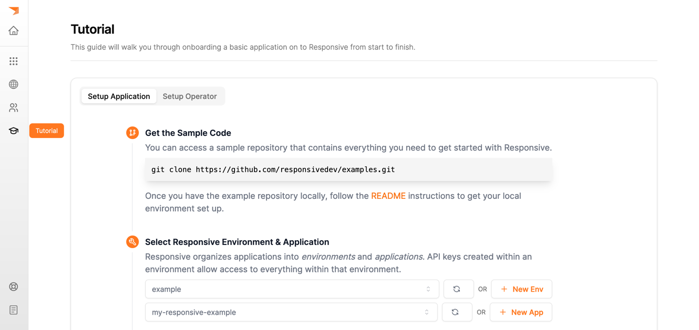
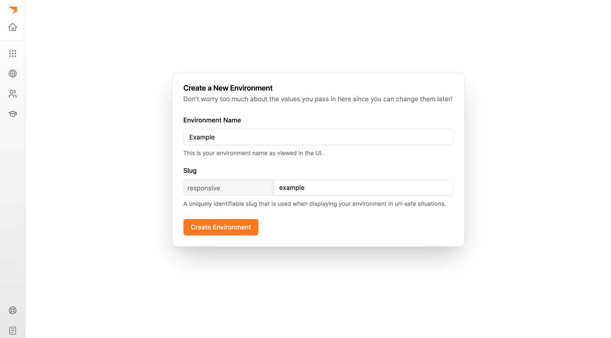
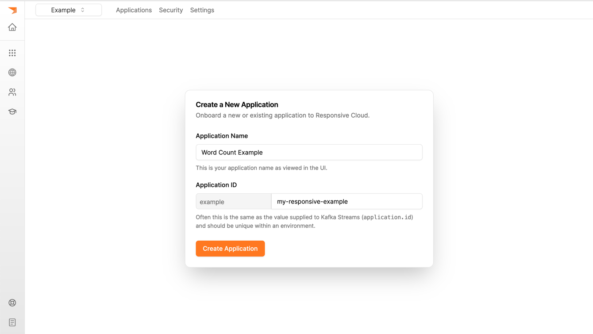
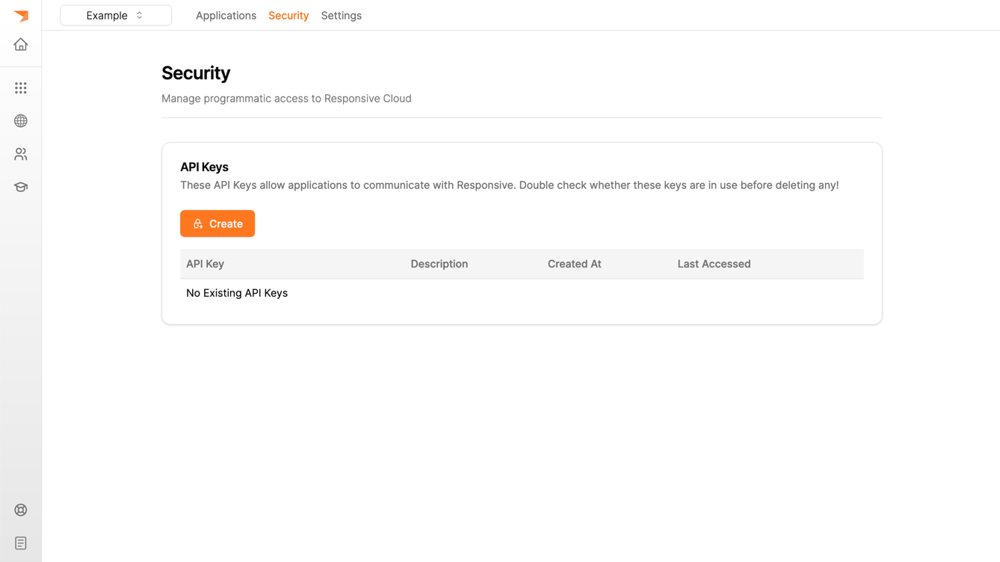
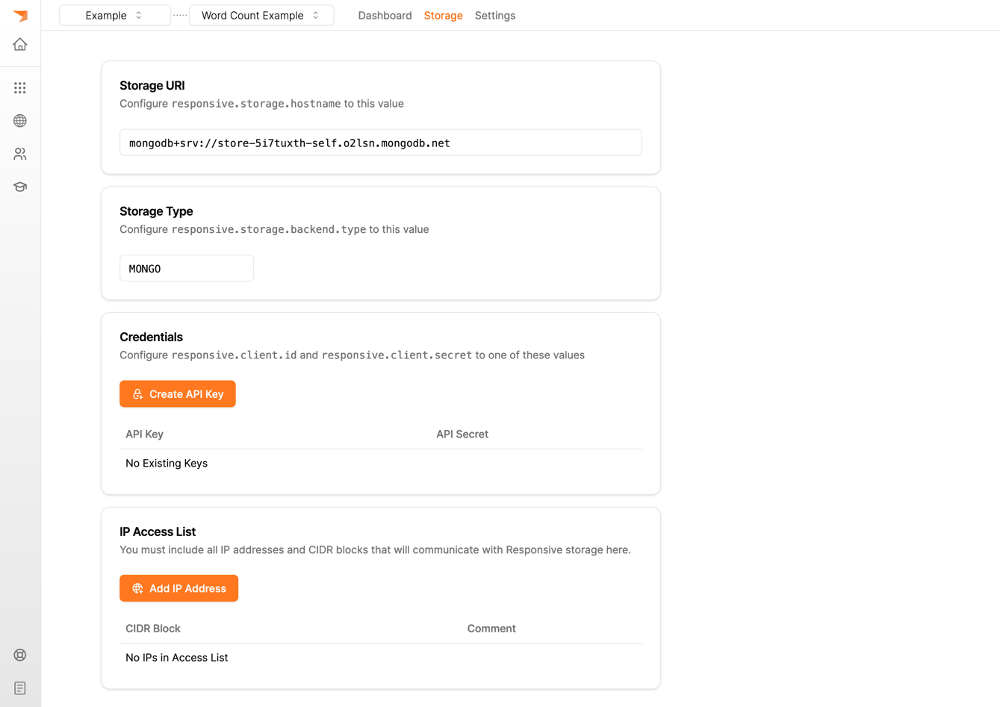
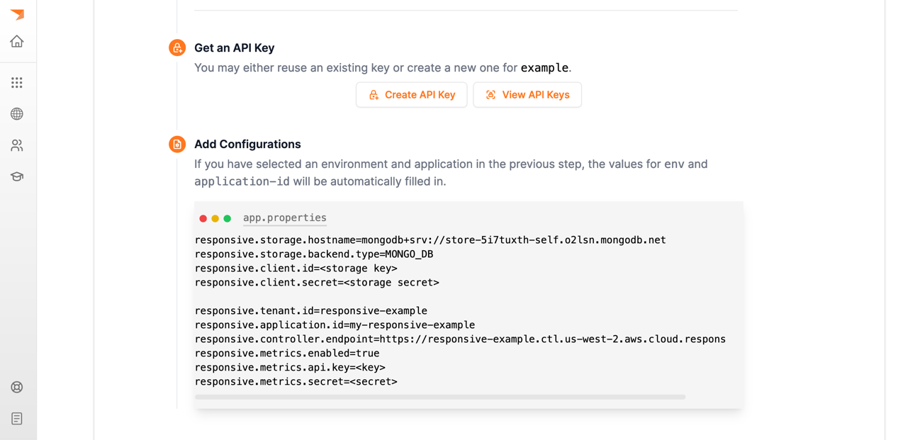

# Responsive Quickstart Example

This repository contains an example Kafka Streams application that runs in a 
local KinD (Kubernetes in Docker) cluster as well as instructions for migrating
to Responsive.

This quickstart will:
- migrate an application from `KafkaStreams` to `ResponsiveKafkaStreams`
- deploy a Responsive autoscaling policy
- outline the key operational metrics on the Responsive observability dashboard

## Building

This quickstart example relies on the presence of a local docker image for
`responsive-example`. You can generate this image by running:

```bash
./gradlew :streams-app:jibDockerBuild
```

## Deploying a KinD Cluster

The next step is to deploy a local k8s cluster with:
1. An example Kafka Streams application which computes word count
2. A Data Generator
3. A Kafka Broker
4. (Optional) A local MongoDB server

Deploy these by running:
```bash
bash ./kind/bootstrap.sh
```

Once this completes, you should be able to see the following pods deployed:
```
$ kubectl get pods -n responsive
NAME                            READY   STATUS    RESTARTS      AGE
example-6c5dd46bd8-2f4r2        1/1     Running   1 (57s ago)   65s
generator-59975d568c-q9dkm      1/1     Running   1 (57s ago)   65s
kafka-broker-75b984c48d-cq928   2/2     Running   0             65s
mongo-855c74c766-cq2gj          1/1     Running   0             65s
```

## Setup Responsive Cloud

Login to https://cloud.responsive.dev and navigate to the Tutorial page (it
is the graduation hat on the left sidebar). 



Follow the instructions to create an environment named `example` and an 
application with the id `my-responsive-example`.



Create a new application:



You should also provision a storage cluster - this will take anywhere from
five to ten minutes. To do so, navigate to the `Storage` tab at the top of
the page, and click `Provision Storage`.

## Migrate to Responsive

### Code Changes

You can either follow the steps in the tutorial UI or apply the patch below to
make the change.

```diff
diff --git a/streams-app/src/main/java/dev/responsive/example/Main.java b/streams-app/src/main/java/dev/responsive/example/Main.java
index 8f8f627..6668c41 100644
--- a/streams-app/src/main/java/dev/responsive/example/Main.java
+++ b/streams-app/src/main/java/dev/responsive/example/Main.java
@@ -16,6 +16,8 @@

 package dev.responsive.example;

+import dev.responsive.kafka.api.ResponsiveKafkaStreams;
+import dev.responsive.kafka.api.stores.ResponsiveStores;
 import java.util.Arrays;
 import java.util.HashMap;
 import java.util.List;
@@ -78,7 +80,7 @@ public class Main {
     props.forEach((k, v) -> config.put((String) k, v));

     final Topology topology = topology();
-    final KafkaStreams streams = new KafkaStreams(topology, props);
+    final KafkaStreams streams = new ResponsiveKafkaStreams(topology, props);

     Runtime.getRuntime().addShutdownHook(new Thread(() -> {
       streams.close();
@@ -119,7 +121,7 @@ public class Main {
         // Group the text words as message keys
         .groupBy((key, value) -> value)
         // Count the occurrences of each word (message key).
-        .count(Materialized.as(Stores.persistentKeyValueStore("word-counts")));
+        .count(Materialized.as(ResponsiveStores.keyValueStore("word-counts")));

     // Store the running counts as a changelog stream to the output topic.
     wordCounts
     
```

You can run `git apply streams-app/src/main/resources/responsive-patch.diff` to apply the change
locally.

### API Keys

You will need API keys for metrics as well as data storage. You can create
both in the Responsive Cloud UI. For the metrics API keys, navigate to the
environment "Security" tab in the top navigation bar (or press the button
to create an API Key in the Tutorial after setting the environment in the
second step):



To create the storage API keys, first wait for the provisioning to complete
and then create your API keys. Since you are running this locally **make sure to add
your local ip to the access list**. This happens within the scope of an application
(so first select your newly crated application):



### Configurations

There are two parts to the configurations:

1. the application configurations (the default is stored in `./kind/app.properties`)
2. the secret configurations

You may choose to simply put all of you configurations in plaintext (since it is
a local cluster) by copy-pasting the configurations displayed in the UI and adding
the values for you secrets into `./kind/app.properties`:



To take advantage of kubernetes secrets, omit the secret configurations from `app.properties` and
put your secrets in a file named `responsive-creds.properties` in the `./secrets` folder of this
repository. This file should contain the following configuration properties:

```properties
# metrics secrets (environment API key)
responsive.platform.api.key=
responsive.platform.api.secret=

# storage secrets
responsive.mongo.username=
responsive.mongo.password=
```

To apply these secrets, run:

```bash
bash ./scripts/update-app-secrets.sh
```

## Rebuild & Redeploy

Now that you have migrated your application to `ResponsiveKafkaStreams` and set
up all the configurations required, the next step is to rebuild and redeploy:

```bash
./gradlew :streams-app:jibDockerBuild
bash ./kind/bootstrap.sh
```

When the application restarts you should start to see metrics on the dashboard.

## Setup Operator & Configure Autoscaling

Follow the steps in the tutorial to set up the operator. Once you have the operator
up and running, you can apply an autoscaling policy:

```bash
kubectl apply -n responsive -f ./kind/policy.yaml
```

This will register `my-responsive-example` with the operator with a policy that
indicates that whenever a single node is processing more than 150 events per second
to scale out and whenever all nodes are processing less than 75 events per second to
scale down.

You may begin varying the event generation rate by scaling the generator deployment
up or down:

```bash
kubectl scale deployment -n responsive generator --replicas <N>
```

Each replica of the generator will generate 100 events per second, so as you scale it up
you will see the processing rate on the dashboard increase

## Troubleshooting

### Getting `Invalid API Key or Secret` in the logs

Make sure that you have properly configured `secrets/responsive-creds.properties`. An
example file looks like this:
```properties
# Responsive API Credentials | responsive-kind
responsive.platform.api.key=ABCDEFGHIJKLMNOP
responsive.platform.api.secret=ABCDEFGHIJKLMNOPQRSTUVWXYZABCDEFG1234567890=
```

### Getting `Exception opening socket` in the logs

Make sure that you have added your local public IP address to the whitelist in the Storage tab
on https://cloud.responsive.dev.

### Helm install command failed with 403

Make sure that your docker credentials are valid, or use `docker logout public.ecr.aws` to
remove them altogether.